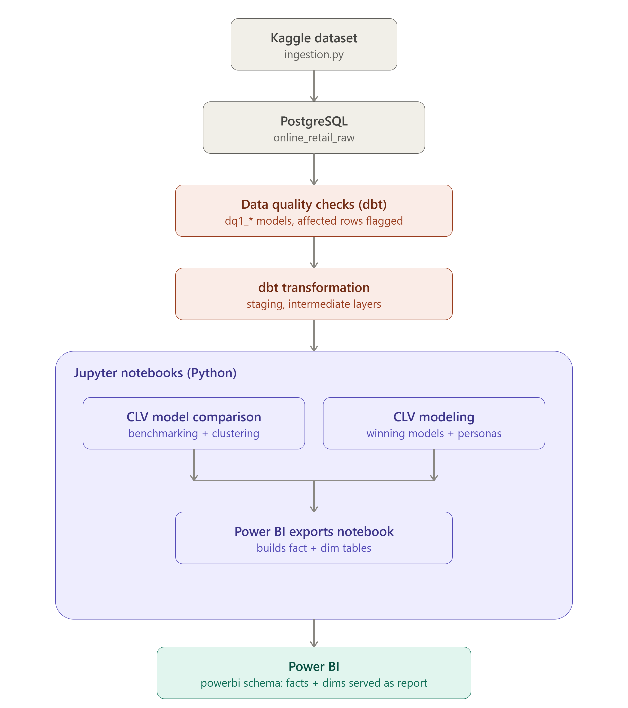
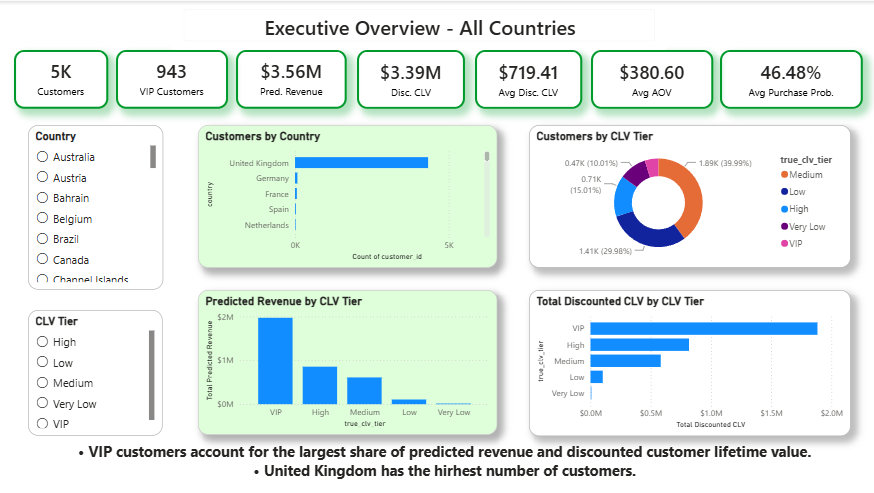
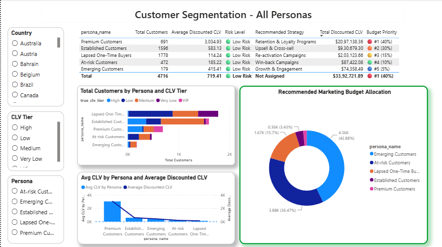
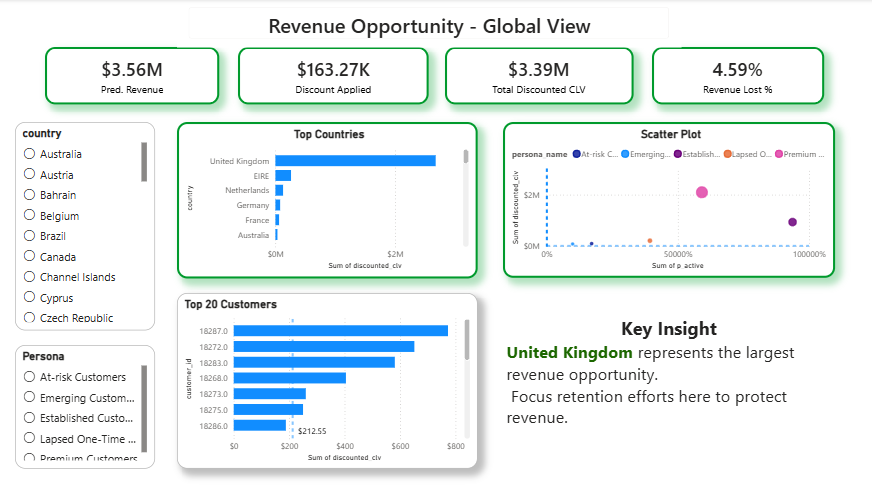
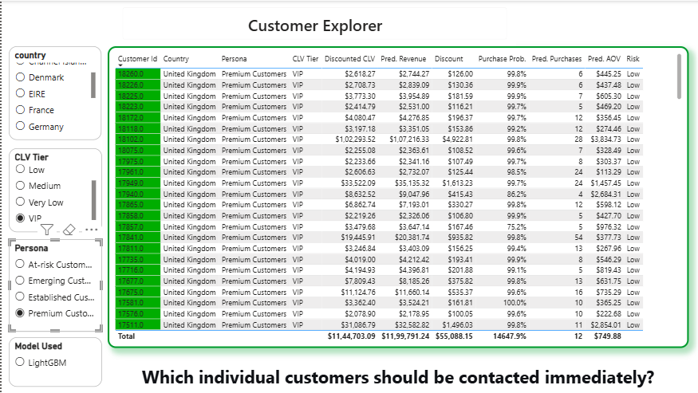

# Executive Summary

This repository presents an end-to-end Customer Lifetime Value (CLV) analytics pipeline built on the Online Retail dataset from Kaggle. The project begins by ingesting transactional data into PostgreSQL and transforming it with dbt to produce clean, analysis-ready datasets. Customer-level features are then engineered to support machine learning, where customers are segmented using clustering and multiple CLV prediction models are benchmarked to identify the best-performing model for each customer segment. The selected models are retrained for production, and the resulting analytical marts are served to Power BI, where interactive dashboards translate the model outputs into actionable business insights for customer segmentation, retention, and revenue optimization.

## Business Problem

The business lacks a clear understanding of which customers are expected to generate the greatest future value and how marketing and retention resources should be allocated accordingly. By segmenting customers into CLV tiers and behavioral personas, the company aims to identify its most valuable customer groups, understand the contribution of each segment to future revenue, prioritize high-value customers for immediate engagement, and determine which countries present the greatest revenue opportunities.

**List of analytical questions:**

- Which customers belong to each CLV tier?
- Which CLV tier contributes the highest predicted revenue?
- What customer personas exist, and how many customers belong to each?
- How are CLV tiers distributed across customer personas?
- How should marketing or retention budgets be allocated across personas based on predicted future value?
- Which countries present the largest future revenue opportunities?
- Which customers should be prioritized for immediate retention or marketing campaigns?

## Project Architecture

**Workflow:**

1. Load Online Retail dataset
2. Store raw data in PostgreSQL
3. Clean and transform using dbt
4. Build customer snapshot
5. Benchmark four CLV models
6. Cluster customers
7. Select best model per cluster
8. Retrain production models
9. Assign customer personas
10. Export analytical tables
11. Build interactive Power BI dashboard

## Key Results

- VIP customers contribute the highest predicted revenue and discounted customer lifetime value.
- The United Kingdom represents the largest revenue opportunity across all countries.
- Emerging Customers and At-risk Customers receive the highest recommended marketing budget allocations, reflecting their strong growth and retention potential.
- UK Premium (VIP) customers should be prioritized for immediate engagement to maximize customer lifetime value, improve retention, and protect future revenue.

## Technical Documentation

- Source documentation: [`src/src.md`](src/src.md)
- dbt models documentation: [`dbt/dbt.md`](dbt/dbt_models.md)
- Notebooks documentation: [`notebooks/notebooks.md`](notebooks/notebooks.md)
- Feature engineering documentation: [`assets/feature_engineering.md`](notebooks/feature_engineering.md)
- Export schemas documentation: [`assets/schemas.md`](powerbi/schemas.md)

## Future Improvements

While the project demonstrates a complete end-to-end Customer Lifetime Value (CLV) analytics pipeline, several enhancements could further improve its scalability, predictive capability, and operational maturity.

- **Automated data pipeline:** Replace the notebook-driven workflow with an orchestrated pipeline using a workflow scheduler such as Apache Airflow or GitHub Actions to automate data ingestion, model retraining, validation, and Power BI data refresh.
- **Real-time or incremental prediction:** Extend the current snapshot-based approach to support incremental feature updates and near real-time CLV predictions as new transactions become available.
- **Advanced feature engineering:** Incorporate additional behavioural features such as product category preferences, seasonal purchasing patterns, customer acquisition channels, and customer service interactions to improve predictive performance.
- **Expanded model benchmarking:** Evaluate additional machine learning approaches, including CatBoost, XGBoost, and ensemble methods, while exploring automated hyperparameter optimisation to improve model accuracy.
- **Model monitoring:** Implement production monitoring to track prediction drift, feature drift, and model performance over time, with automated alerts when retraining becomes necessary.
- **Deployment as an analytical service:** Package the prediction pipeline as a REST API or scheduled service so that downstream applications can request updated CLV predictions without executing notebooks manually.
- **Power BI deployment:** Publish the dashboard to the Power BI Service with scheduled refresh, role-based access control, and row-level security to support enterprise reporting and collaboration.

These enhancements would transition the project from a portfolio demonstration into a production-ready analytics solution capable of supporting continuous business decision-making.
