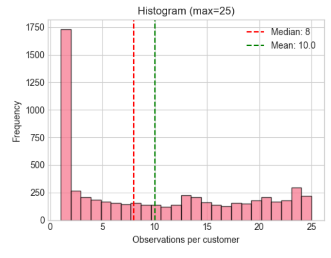
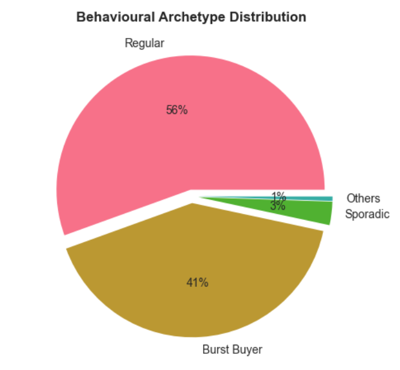
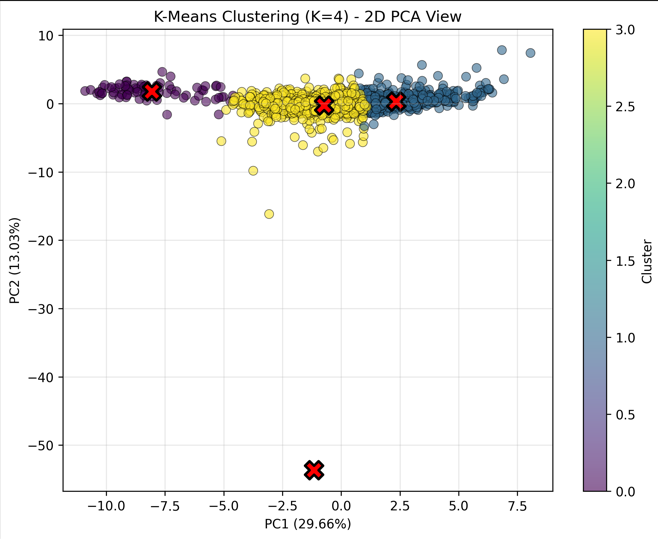
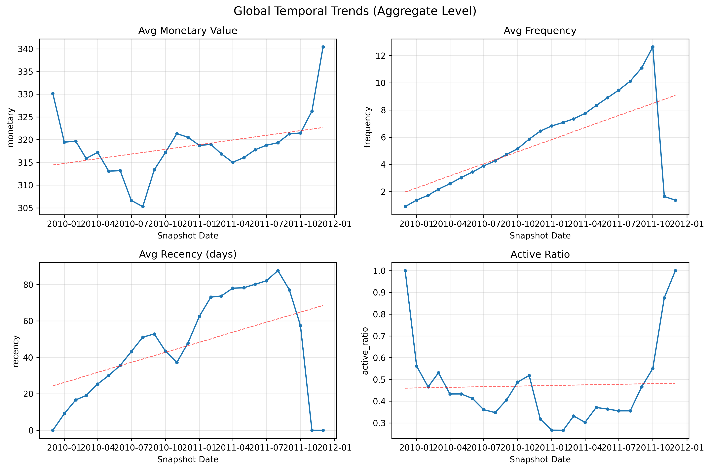

# 1. Introduction

Customer Lifetime Value (CLV) modeling is often approached as a straightforward prediction problem. In practice, however, customer behavior is rarely clean, stationary, or statistically well-behaved.

Before building predictive models, it is important to understand:
* whether customer behavior is homogeneous or highly segmented,
* whether purchasing patterns are stable over time,
* whether classical probabilistic assumptions are defensible,
* and how the observed behavioral structure should influence feature engineering and model design.

This report documents the statistical and behavioral diagnostics performed before feature engineering and model training.

The analysis combines:
* exploratory behavioral analysis,
* customer-level distribution fitting,
* clustering and latent segmentation,
* temporal trend analysis,
* stationarity testing,
* and sparsity diagnostics.

The objective is not to optimize performance yet, but to answer a more fundamental question:

> *What kind of modeling framework does this data actually support?*

The findings from these analyses directly motivate the downstream modeling strategy.
Rather than treating feature engineering as generic preprocessing, this report frames it as a statistical response to the observed structure of the data-generating process.

# 2. Dataset Structure & Observational Constraints

The dataset tracks customer transactional behavior across 25 temporal snapshots, creating a longitudinal panel suitable for sequential CLV analysis.

Core behavioral variables include:

* purchase frequency,
* monetary value,
* recency,
* and customer activity state over time.

A key structural characteristic of the dataset is **unequal observation depth** across customers.

Some customers appear consistently across many snapshots, while a large portion appear only briefly.

*Figure 1. Distribution of observations per customer (max = 25 snapshots). Mean = 10, median = 8.*

This imbalance introduces an important modeling constraint:

> customer behavior must be learned under highly uneven historical coverage.

The implications are significant:

* sparse customers produce unstable statistical estimates,
* customer-level distribution fitting becomes less reliable,
* temporal persistence signals become noisy,
* and classical parametric estimation becomes sensitive to low-observation histories.

The dataset also captures behavior within a finite observation window rather than complete customer lifetimes. Consequently:

* churn is not directly observed,
* inactivity may be temporary rather than permanent,
* and right-censoring effects may exist.

These constraints become especially important when evaluating traditional CLV frameworks, many of which implicitly assume stable purchase histories and well-defined customer death processes.

# 3. Why Classical CLV Assumptions Were Audited

Many traditional Customer Lifetime Value frameworks — including Pareto/NBD and BG/NBD — rely on strong statistical assumptions about customer behavior.

These models generally assume:

* relatively stable purchase processes,
* identifiable customer “death” behavior,
* sufficient transactional history,
* and population behavior that can be represented by a small set of parametric distributions.

Before adopting or rejecting these frameworks, it was necessary to determine whether the dataset actually exhibited those properties.

Several characteristics observed during the initial EDA suggested potential assumption violations:

* highly unequal customer observation depth,
* intermittent activity patterns,
* strong behavioral heterogeneity,
* sparse customer histories,
* and potentially non-stationary temporal dynamics.

These signals motivated a deeper statistical audit focused on:

1. behavioral segmentation,
2. distributional structure,
3. temporal persistence,
4. stationarity,
5. sparsity,
6. and customer-level variability.

The objective was not to “disprove” classical CLV models, but to evaluate whether the observed data-generating process aligned with their underlying assumptions strongly enough to justify their use.

# 4. Behavioral Heterogeneity

Customer behavior in the dataset is not homogeneous.

Behavioral segmentation revealed two dominant customer regimes:

* **Regular customers (56%)** with relatively stable purchasing behavior,
* and **Burst Buyers (41%)** characterized by intermittent and clustered activity patterns.

The remaining customer population consists of smaller sporadic and extreme-behavior groups, indicating the presence of long-tail behavioral variability.

Unsupervised clustering further supported this structure. Customers formed distinct behavioral regions in feature space rather than a single continuous population.

This finding is important because many classical CLV frameworks implicitly assume customer behavior can be represented by a relatively stable shared probabilistic process.

Instead, the observed structure suggests:

* heterogeneous purchasing dynamics,
* multiple behavioral regimes,
* and non-uniform temporal activity patterns across customers.

These findings directly motivate:

* behavioral segmentation features,
* cluster-aware feature engineering,
* and flexible non-parametric modeling approaches such as LightGBM.

# 5. Distributional & Temporal Diagnostics

The dataset exhibits clear temporal structure rather than fully stable customer behavior over time.

Average purchase frequency increased substantially across the observation window, while monetary behavior remained comparatively stable.

*Figure 4. Aggregate behavioral trends across the 25 temporal snapshots.*

Key observations:

* average frequency increased by approximately **53%**,
* monetary value showed mild upward drift,
* recency dynamics changed meaningfully across time,
* and customer activity levels fluctuated across periods.

Stationarity testing further suggested that customer behavior was not fully time-invariant:

* ADF test failed to reject non-stationarity,
* KPSS testing also indicated temporal instability.

Autocorrelation analysis revealed moderate behavioral persistence:

* frequency showed strong lag-1 dependence *(0.69)*,
* while monetary behavior exhibited weaker persistence *(0.50 at lag 1)*.

Based on these values, time-decayed features will use α = 0.85 for frequency (lag-1 = 0.69) and α = 0.70 for monetary (lag-1 = 0.50), following the heuristic that α should approximate the lag-1 autocorrelation with moderate smoothing to avoid overfitting (Fader & Hardie, 2005).
These findings have direct modeling implications:

* historical behavior should not be weighted uniformly,
* temporal ordering must be preserved during validation,
* and feature engineering should incorporate time-decayed and lag-based behavioral representations.

The observed temporal drift also supports:

* rolling or expanding-window validation,
* periodic model retraining,
* and adaptive ensemble methods capable of handling evolving behavioral structure.

# 6. Sparsity & Observability Constraints

Beyond behavioral heterogeneity and temporal drift, the dataset also exhibits substantial sparsity at the customer level.

More than half of customers  (52.9%) appear in relatively few temporal snapshots (<10 observations), limiting the reliability of:

* customer-level distribution fitting,
* persistence estimation,
* and individualized statistical inference.

This creates an important asymmetry in the dataset:

* a small subset of customers contributes dense behavioral histories,
* while many customers provide only fragmented behavioral signals.

In addition, customer lifetimes are only partially observed within the available time horizon. As a result:

* inactivity cannot always be interpreted as permanent churn,
* customer “death” is not directly observable,
* and right-censoring effects may exist near dataset boundaries.

These constraints weaken the assumptions required by many classical CLV frameworks, particularly those relying on:

* stable customer histories,
* explicit churn processes,
* and reliable customer-level parameter estimation.

From a modeling perspective, the observed sparsity strongly favors approaches that:

* borrow statistical strength across customers,
* remain robust under incomplete histories,
* and avoid heavy dependence on per-customer probabilistic estimation.

This further motivates the use of ensemble gradient boosting methods with regularization and sparsity-aware split handling.

# 7. Feature Engineering Implications

The statistical audit suggests that feature engineering should prioritize temporal adaptation and behavioral representation rather than relying solely on static aggregate RFM metrics.

The observed temporal persistence supports:

* lag-based behavioral features,
* rolling behavioral summaries,
* and exponentially decayed transaction statistics.

Because customer behavior is heterogeneous rather than homogeneous, feature engineering should also incorporate:

* behavioral archetype indicators,
* cluster membership features,
* and activity-state representations.

The partially observed nature of customer lifetimes additionally motivates:

* censoring indicators,
* inactivity duration features,
* and time-to-event windows suitable for survival-aware behavioral modeling.

Temporal segmentation should also account for lifecycle effects through:

* acquisition cohort indicators,
* customer age features,
* and cohort-relative behavioral normalization.

In addition, the presence of sparse and intermittent customer histories motivates:

* robustness to missing observations,
* recency-aware aggregation,
* and features capable of separating temporary inactivity from persistent disengagement.

The resulting feature engineering framework therefore emphasizes:

* temporal dynamics,
* behavioral state transitions,
* historical decay weighting,
* latent customer segmentation,
* and survival-aware behavioral encoding.

Rather than treating customer behavior as stationary, the engineered features are designed to capture evolving behavioral trajectories across time.

# 8. Why LightGBM

The analyses conducted throughout this report suggest that the dataset violates several assumptions commonly required by classical parametric CLV frameworks.

In contrast, LightGBM is well suited to the observed data structure because it:

* handles heterogeneous behavioral regimes effectively,
* remains robust under sparse and incomplete histories,
* captures non-linear interactions automatically,
* and accommodates mixed temporal and behavioral feature representations.

The model is particularly appropriate given:

* non-stationary customer behavior,
* unequal observation depth,
* intermittent activity patterns,
* and cluster-specific purchasing dynamics.

Unlike fixed probabilistic frameworks, gradient boosting does not require customer behavior to follow a single shared parametric process.

This flexibility is important because the analyses indicate that customer behavior is:

* segmented rather than homogeneous,
* temporally evolving rather than stationary,
* and only partially observable within the available horizon.

LightGBM also provides practical advantages for longitudinal CLV modeling:

* efficient handling of high-dimensional engineered features,
* robustness to missing values,
* embedded feature selection through split optimization,
* and strong predictive performance under structured tabular data settings.

# 9. Validation Strategy, Limitations & Conclusion

Because customer behavior exhibits temporal drift and persistence, random train-test splitting would risk temporal leakage and overly optimistic evaluation.

Model validation should therefore preserve temporal ordering through expanding-window evaluation (training on all data before date T, testing on T+1). Given the random walk behavior in frequency, this approach preserves the cumulative nature of the trend while avoiding look-ahead bias. Chronologically separated holdout periods are also acceptable.

This ensures that models are evaluated under conditions that better approximate real-world deployment.

Several limitations should also be acknowledged:

* customer lifetimes are only partially observed,
* inactivity cannot always be interpreted as churn,
* sparse histories reduce reliability for some customers,
* and behavioral dynamics may continue evolving beyond the observed horizon.

Despite these constraints, the analyses consistently indicate that the dataset contains meaningful behavioral structure suitable for predictive modeling.

Overall, the statistical evidence supports a modeling framework centered on:

* temporally aware feature engineering,
* behavioral segmentation,
* recency-sensitive representations,
* and adaptive ensemble gradient boosting using LightGBM.

The downstream modeling pipeline is therefore designed not as a generic ML workflow, but as a direct response to the observed structure of the customer behavioral process.

